# System Architecture & Data Schema · Open Studio AMP

## 1. Decoupled Repository Folder Structure

```text
open-studio-amp/
├── data/
│   ├── raw/                 # Raw genomes (.faa, .fna) - Local cache & fallback
│   └── processed/           # Screening outputs (.csv) & Comparative reports (.md)
├── src/
│   ├── __init__.py
│   ├── fetcher.py           # NCBI Entrez API downloader + SHA256 integrity + Cache fallback
│   ├── extractor.py         # Phase 1 (CDS) & Phase 2 (6-frame sORF tri-start) extractor
│   ├── filters.py           # Physicochemical calculation engine, scoring & biopreservation narratives
│   ├── theme.py             # Single Source of Truth (SSoT) tokens, CSS & bilingual UX microcopy
│   ├── structure.py         # 3D molecular coordinates generator & 3Dmol.js rendering
│   └── reporter.py          # Academic monochrome PDF dossier generator (FPDF2)
├── tests/
│   ├── __init__.py
│   ├── test_biochem.py              # Unit tests for positive/negative controls & biochemical formulas
│   ├── test_extraction.py           # Unit tests for fetcher, sha256 & 6-frame extraction
│   ├── test_custom_ingestion.py     # Unit tests for in-memory FASTA parsing & sequence detection
│   ├── test_modular_architecture.py # Unit tests for modular decoupling & I18N parity
│   ├── test_ui_sorting_search.py    # Unit tests for sorting, motif search & smart label formatting
│   ├── test_parity_fastpath.py      # Unit tests for optimized O(N) evaluation vs reference parity
│   ├── test_security.py             # Unit tests for XSS prevention and payload sanitation
│   └── local_controls.py            # Suite for local food bioactive peptide expansion
├── app.py                   # Streamlit interactive web studio controller
├── engine.py                # CLI pipeline orchestrator & Case study generator
├── requirements.txt         # Python library dependencies
├── PRD.md                   # Product requirements
├── CONTRIBUTING.md          # Guidelines for contributing & CI/CD standards
├── METHODOLOGY.md           # Biochemical mathematical formulas
├── ARCHITECTURE.md          # System architecture & data contracts
└── README.md                # Main project documentation
```

---

## 2. Data Flow & Execution Diagram

```mermaid
flowchart TD
    %% INGESTION LAYER
    subgraph INGESTION ["📥 1. Data Ingestion & Genome Input"]
        direction TB
        A1["🧬 NCBI BioProject PRJDB8096<br/>(G. thermocatenulatus PLS47)"]:::inputStyle
        A2["📂 Custom Genome FASTA<br/>(.faa / .fna / .fasta / Manual Paste)"]:::inputStyle
        B["🛡️ Genome Ingestion & Cache Engine<br/>(src/fetcher.py • SHA256 Cryptographic Checksum)"]:::cacheStyle
        A1 --> B
        A2 --> B
    end

    %% EXTRACTION LAYER
    subgraph EXTRACTION ["⚙️ 2. Dual-Phase Sequence Extraction (src/extractor.py)"]
        direction TB
        B --> C1["🧪 Phase 1: Annotated CDS<br/>(Short Coding Sequences: .faa)"]:::extractStyle
        B --> C2["🔬 Phase 2: Cryptic sORFs<br/>(6-Frame Translation: .fna • Tri-Start ATG/GTG/TTG)"]:::sorfStyle
    end

    %% FILTERING LAYER
    subgraph FILTERING ["🧪 3. Tropical Food Filter Matrix (7 Parameters) (src/filters.py)"]
        direction TB
        C1 & C2 --> D["âš¡ Physicochemical Calculation Engine"]:::calcStyle
        D --> F1["1️⃣ Charge @ pH 6.0 &ge; +2.0<br/>(Bacterial Wall Penetration)"]:::filterStyle
        D --> F2["2️⃣ Isoelectric Point pI &ge; 8.4<br/>(Prevents Food Precipitation)"]:::filterStyle
        D --> F3["3️⃣ Aliphatic Index &ge; 60.0<br/>(Tropical Heat Resistance • Gold &ge; 80)"]:::filterStyle
        D --> F4["4️⃣ Instability Index &lt; 40.0<br/>(Shelf-life Stability)"]:::filterStyle
        D --> F5["5️⃣ Hydrophobic Ratio 30-55%<br/>(Cell Membrane Insertion)"]:::filterStyle
        D --> F6["6️⃣ Boman Index 0-2.5 kcal/mol<br/>(Host Cell Safety)"]:::filterStyle
        D --> F7["7️⃣ Sequence Length 5-100 aa<br/>(SPPS Synthesis Efficiency)"]:::filterStyle
    end

    %% SCORING LAYER
    subgraph SCORING ["🏆 4. Preservation Evaluation & Ranking"]
        direction TB
        F1 & F2 & F3 & F4 & F5 & F6 & F7 --> S["🌟 AliphaScore-35 (AS-35) Composite Score (0–100)<br/>AS-35 = 0.30 S_thermal + 0.25 S_charge + 0.20 S_stability + 0.15 S_hydro + 0.10 S_membrane"]:::scoreStyle
    end

    %% OUTPUT LAYER
    subgraph OUTPUT ["📊 5. Output & Studio Deliverables"]
        direction TB
        S --> O1["📁 CSV Database & Case Study<br/>(data/processed/ • engine.py)"]:::csvStyle
        S --> O2["🖥️ Open Studio AMP Dashboard<br/>(Streamlit Web UI • app.py)"]:::uiStyle
        S --> O3["🧬 3D Molecular Visualization<br/>(Interactive 3Dmol.js • src/structure.py)"]:::molStyle
        S --> O4["📄 Academic PDF Dossier<br/>(2-Page Monochrome Report • src/reporter.py)"]:::pdfStyle
    end

    %% CLASS DEFINITIONS & COLOR THEMES
    classDef inputStyle fill:#0A192F,stroke:#0E8388,stroke-width:2px,color:#38BDF8,font-weight:bold;
    classDef cacheStyle fill:#172A45,stroke:#0E8388,stroke-width:2px,color:#E2E8F0;
    classDef extractStyle fill:#2E1065,stroke:#8B5CF6,stroke-width:2px,color:#EDE9FE;
    classDef sorfStyle fill:#3B0764,stroke:#A855F7,stroke-width:2px,color:#FAF5FF;
    classDef calcStyle fill:#0F172A,stroke:#38BDF8,stroke-width:2px,color:#F8FAFC,font-weight:bold;
    classDef filterStyle fill:#064E3B,stroke:#10B981,stroke-width:2px,color:#ECFDF5;
    classDef scoreStyle fill:#78350F,stroke:#F59E0B,stroke-width:3px,color:#FEF3C7,font-weight:bold;
    classDef csvStyle fill:#1E293B,stroke:#94A3B8,stroke-width:2px,color:#F8FAFC;
    classDef uiStyle fill:#0E8388,stroke:#14B8A6,stroke-width:2px,color:#FFFFFF,font-weight:bold;
    classDef molStyle fill:#1E1B4B,stroke:#6366F1,stroke-width:2px,color:#EEF2FF,font-weight:bold;
    classDef pdfStyle fill:#831843,stroke:#FB7185,stroke-width:2px,color:#FFF1F2,font-weight:bold;
```



---

## 3. Peptide Candidate Data Schema (Pandas / JSON Contract)

```json
{
    "id": "PLS47_sORF_F-2_23852_4020_4172",     // Unique sequence identifier
    "sequence": "MKTLVI...",                      // Clean primary amino acid sequence (A-Z)
    "length": 50,                                 // Peptide length (amino acid residues)
    "isoelectric_point": 10.82,                   // Isoelectric Point (pI >= 8.4)
    "charge_ph4": 11.45,                          // Net charge at pH 4.0 (Acidic Foods)
    "charge_ph6": 9.04,                           // Net charge at pH 6.0 (Low-Acid Foods)
    "charge_ph7": 7.12,                           // Net charge at pH 7.4 (Neutral Matrix)
    "aliphatic_index": 118.80,                    // Aliphatic Index (Tropical Thermal Resistance)
    "instability_index": -6.42,                   // Instability Index (< 40 = Stable)
    "hydrophobic_ratio": 42.0,                    // Hydrophobic Amino Acid Percentage (30-55%)
    "gravy": 0.32,                                // Grand Average of Hydropathicity
    "boman_index": 1.23,                          // Boman Index (0.0 - 2.5 kcal/mol)
    "as35_score": 94.72,                          // AliphaScore-35 (AS-35) Composite Score (0.0 - 100.0)
    "thermostability_tier": "Gold Standard (AI >= 80)", // Temperature resistance category
    "passed_all_filters": true                    // True if it passes all 7 food criteria
}
```

