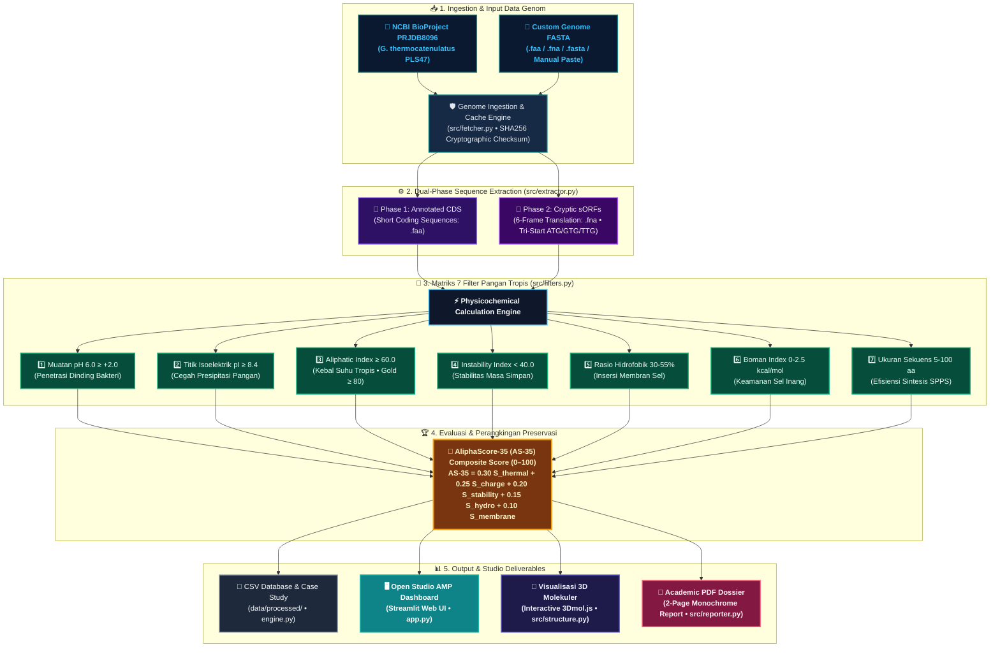

# System Architecture & Data Schema · Open Studio AMP

## 1. Struktur Folder Repositori Terdekoplasi

```text
open-studio-amp/
├── data/
│   ├── raw/                 # Genom mentah (.faa, .fna) - Cache lokal & fallback
│   └── processed/           # Output skrining (.csv) & Laporan komparatif (.md)
├── src/
│   ├── __init__.py
│   ├── fetcher.py           # Downloader NCBI Entrez API + SHA256 integrity + Cache fallback
│   ├── extractor.py         # Ekstraktor Phase 1 (CDS) & Phase 2 (6-frame sORF tri-start)
│   ├── filters.py           # Mesin hitung sifat fisikokimia, scoring & narasi biopreservasi
│   ├── theme.py             # Single Source of Truth (SSoT) tokens, CSS & bilingual UX microcopy
│   ├── structure.py         # 3D molecular coordinates generator & 3Dmol.js rendering
│   └── reporter.py          # Academic monochrome PDF dossier generator (FPDF2)
├── tests/
│   ├── __init__.py
│   ├── test_biochem.py              # Unit test kontrol positif, negatif & formula biokimia
│   ├── test_extraction.py           # Unit test fetcher, sha256 & 6-frame extraction
│   ├── test_custom_ingestion.py     # Unit test in-memory FASTA parser & sequence detection
│   ├── test_modular_architecture.py # Unit test decoupling modular & parity I18N
│   ├── test_ui_sorting_search.py    # Unit test sorting, motif search & smart label formatting
│   └── local_controls.py            # Suite ekspansi peptida bioaktif pangan lokal
├── app.py                   # Controller web studio interaktif Streamlit
├── engine.py                # Pipeline orchestrator CLI & Case study generator
├── requirements.txt         # Daftar dependensi library Python
├── PRD.md                   # Spesifikasi produk
├── METHODOLOGY.md           # Formula matematika biokimia
├── ARCHITECTURE.md          # Arsitektur sistem & kontrak data
├── TASK.md                  # Tracker pengerjaan bertahap
└── README.md                # Dokumentasi utama proyek
```

---

## 2. Diagram Alur Data & Eksekusi



---

## 3. Skema Data Kandidat Peptida (Pandas / JSON Contract)

```json
{
    "id": "PLS47_sORF_F-2_23852_4020_4172",     // Identifikasi sekuens unik
    "sequence": "MKTLVI...",                      // Sekuens asam amino primer bersih (A-Z)
    "length": 50,                                 // Panjang peptida (residu asam amino)
    "isoelectric_point": 10.82,                   // Titik Isoelektrik (pI >= 8.4)
    "charge_ph4": 11.45,                          // Muatan bersih pada pH 4.0 (Pangan Asam)
    "charge_ph6": 9.04,                           // Muatan bersih pada pH 6.0 (Pangan Rendah Asam)
    "charge_ph7": 7.12,                           // Muatan bersih pada pH 7.4 (Matriks Netral)
    "aliphatic_index": 118.80,                    // Indeks Alifatik (Ketahanan Termal Tropis)
    "instability_index": -6.42,                   // Indeks Instabilitas (< 40 = Stabil)
    "hydrophobic_ratio": 42.0,                    // Persentase Asam Amino Hidrofobik (30-55%)
    "gravy": 0.32,                                // Grand Average of Hydropathicity
    "boman_index": 1.23,                          // Indeks Boman (0.0 - 2.5 kcal/mol)
    "as35_score": 94.72,                        // AliphaScore-35 (AS-35) Composite Score (0.0 - 100.0)
    "thermostability_tier": "Gold Standard (AI >= 80)", // Kategori ketahanan suhu
    "passed_all_filters": true                    // True jika lolos seluruh 7 kriteria pangan
}
```