<div align="center">

# 🧬 Open Studio AMP
### *Tropical Food Biopreservation Engine & In Silico AMP Miner*
**Mining Heat-Tolerant Antimicrobial Peptides from Indonesian Soil Thermophiles and Custom Genomes for Cold-Chain Free Food Preservation**

<p align="center">
  <a href="https://www.python.org/"></a>
  <a href="https://streamlit.io/"></a>
  <a href="https://pytest.org/"></a>
  <a href="https://www.ncbi.nlm.nih.gov/bioproject/PRJDB8096"></a>
  <a href="https://www.ncbi.nlm.nih.gov/bioproject/PRJDB8096"></a>
  <a href="LICENSE"></a>
</p>

</div>

---

## 📌 1. Background & Research Urgency

### 🔴 The Tropical Cold-Chain Dilemma
In tropical regions, ambient temperatures regularly hover between **28°C and 35°C** with high relative humidity. For perishable foods such as pasteurized dairy, plant based beverages, fresh tofu, and ready to eat meals unreliable refrigeration during transport leads to frequent thermal abuse. Spore forming and psychrotolerant pathogens (*Bacillus cereus*, *Listeria monocytogenes*, *Salmonella enterica*) multiply quickly when the cold chain breaks.

### ⚠️ Why Existing Preservatives Fall Short
1. **Synthetic Additives Face Pushback:** Chemical preservatives like benzoates, sorbates, and nitrites face increasing consumer rejection and stricter regulatory limits under clean-label standards.
2. **Mesophilic Biopreservatives Degrade in Heat:** The commercial biological standard, **Nisin A (E234)**, originates from the mesophile *Lactococcus lactis*. Under tropical ambient heat (>30°C) and neutral to low acid food conditions (pH ~6.0), Nisin A suffers thermal conformational degradation and rapid loss of antimicrobial potency.

### 🟢 The Open Studio AMP Approach
Instead of expensive wet-lab trial-and-error synthesizing hundreds of untested peptide variants, **Open Studio AMP** applies targeted computational screening to extremophile genomes (such as the Indonesian geothermal isolate *Geobacillus thermocatenulatus* PLS47; NCBI BioProject: `PRJDB8096`).

The pipeline filters sequences directly against practical food processing constraints:
* **Thermal Stability:** Maintaining structural integrity through pasteurization and ambient storage ($\text{AI} \ge 60.0$, ideal $\ge 80.0$).
* **Electrostatic Binding:** Retaining net positive charge at food pH 6.0 ($Z \ge +2.0$) to penetrate anionic microbial cell membranes.
* **Solution Stability:** Preventing spontaneous degradation during shelf storage ($\text{II} < 40.0$).
* **Custom Ingestion:** Benchmarking your own indigenous bacterial isolates directly in the studio.

---

## 🏗️ 2. Computational Pipeline Architecture

```mermaid
flowchart TD
    %% INGESTION LAYER
    subgraph INGESTION ["📥 1. Genomic Data Ingestion"]
        direction TB
        A1["🧬 NCBI BioProject PRJDB8096<br/>(G. thermocatenulatus PLS47)"]:::inputStyle
        A2["📂 Custom FASTA Genome<br/>(.faa / .fna / .fasta / Manual Paste)"]:::inputStyle
        B["🛡️ Genome Ingestion & Cache Engine<br/>(src/fetcher.py • SHA256 Cryptographic Checksum)"]:::cacheStyle
        A1 --> B
        A2 --> B
    end

    %% EXTRACTION LAYER
    subgraph EXTRACTION ["⚙️ 2. Dual-Phase Sequence Extraction (src/extractor.py)"]
        direction TB
        B --> C1["🧪 Phase 1: Annotated CDS<br/>(Short Coding Sequences: .faa)"]:::extractStyle
        B --> C2["🔬 Phase 2: Cryptic sORFs<br/>(6-Frame Translation: .fna • Tri-Start ATG/GTG/TTG)"]:::sorfStyle
    end

    %% FILTERING LAYER
    subgraph FILTERING ["🧪 3. 7-Tier Tropical Food Matrix Filters (src/filters.py)"]
        direction TB
        C1 & C2 --> D["âš¡ Physicochemical Calculation Engine"]:::calcStyle
        D --> F1["1️⃣ Net Charge @ pH 6.0 &ge; +2.0<br/>(Cell Wall Electrostatic Penetration)"]:::filterStyle
        D --> F2["2️⃣ Isoelectric Point pI &ge; 8.4<br/>(Prevents Food Matrix Precipitation)"]:::filterStyle
        D --> F3["3️⃣ Aliphatic Index &ge; 60.0<br/>(Heat Stability • Gold &ge; 80)"]:::filterStyle
        D --> F4["4️⃣ Instability Index &lt; 40.0<br/>(Shelf-Life Solution Stability)"]:::filterStyle
        D --> F5["5️⃣ Hydrophobic Ratio 30-55%<br/>(Membrane Core Insertion)"]:::filterStyle
        D --> F6["6️⃣ Boman Index 0-2.5 kcal/mol<br/>(Host Cell Safety / Non-Toxic)"]:::filterStyle
        D --> F7["7️⃣ Sequence Length 5-100 aa<br/>(SPPS Synthesis Efficiency)"]:::filterStyle
    end

    %% SCORING LAYER
    subgraph SCORING ["🏆 4. Preservation Composite Evaluation"]
        direction TB
        F1 & F2 & F3 & F4 & F5 & F6 & F7 --> S["🌟 AliphaScore-35 (AS-35) Composite Score (0–100)<br/>Score = 0.30 S_thermal + 0.25 S_charge + 0.20 S_stability + 0.15 S_hydro + 0.10 S_membrane"]:::scoreStyle
    end

    %% OUTPUT LAYER
    subgraph OUTPUT ["📊 5. Output & Studio Deliverables"]
        direction TB
        S --> O1["📁 CSV Database & Case Study<br/>(data/processed/ • engine.py)"]:::csvStyle
        S --> O2["🖥️ Open Studio AMP Dashboard<br/>(Streamlit Web UI • app.py)"]:::uiStyle
        S --> O3["🧬 3D Molecular Viewport<br/>(Interactive 3Dmol.js • src/structure.py)"]:::molStyle
        S --> O4["📄 Academic PDF Dossier<br/>(2-Page Monochrome Report • src/reporter.py)"]:::pdfStyle
    end

    %% CLASS DEFINITIONS & COLOR THEMES
    classDef inputStyle fill:#0A192F,stroke:#0E8388,stroke-width:2px,color:#38BDF8,font-weight:bold;
    classDef cacheStyle fill:#172A45,stroke:#0E8388,stroke-width:2px,color:#E2E8F0;
    classDef extractStyle fill:#2E1065,stroke:#8B5CF6,stroke-width:2px,color:#EDE9FE;
    classDef sorfStyle fill:#3B0764,stroke:#A855F7,stroke-width:2px,color:#FAF5FF;
    classDef calcStyle fill:#0F172A,stroke:#38BDF8,stroke-width:2px,color:#F8FAFC,font-weight:bold;
    classDef filterStyle fill:#064E3B,stroke:#10B981,stroke-width:2px,color:#ECFDF5;
    classDef scoreStyle fill:#78350F,stroke:#F59E0B,stroke-width:3px,color:#FEF3C7,font-weight:bold;
    classDef csvStyle fill:#1E293B,stroke:#94A3B8,stroke-width:2px,color:#F8FAFC;
    classDef uiStyle fill:#0E8388,stroke:#14B8A6,stroke-width:2px,color:#FFFFFF,font-weight:bold;
    classDef molStyle fill:#1E1B4B,stroke:#6366F1,stroke-width:2px,color:#EEF2FF,font-weight:bold;
    classDef pdfStyle fill:#831843,stroke:#FB7185,stroke-width:2px,color:#FFF1F2,font-weight:bold;
```



---

## 📐 3. Biochemical Formulations & Food Matrix Constraints

| No | Physicochemical Parameter | Mathematical Formulation | Qualification Threshold | Food Industry Rationale |
| :---: | :--- | :--- | :--- | :--- |
| **1** | **Net Charge ($Z$) @ pH 6.0** | Henderson-Hasselbalch (Lehninger pKa scale) | $\ge +2.0$ | Electrostatic binding to anionic bacterial membranes in low-acid foods. |
| **2** | **Isoelectric Point ($\text{pI}$)** | Bisection root search $Z(\text{pH}) = 0$ | $\ge 8.4$ | Maintains net positive charge; prevents isoelectric precipitation and clumping. |
| **3** | **Aliphatic Index ($\text{AI}$)** | Ikai (1980): $X_A + 2.9X_V + 3.9(X_I + X_L)$ | $\ge 60.0$ (Ideal $\ge 80.0$) | High thermal conformational stability through pasteurization and ambient heat. |
| **4** | **Instability Index ($\text{II}$)** | Guruprasad (1990): $\frac{10}{L} \sum \text{DIWV}$ | $< 40.0$ (Stable) | Resistance to spontaneous peptide degradation during prolonged shelf storage. |
| **5** | **Hydrophobic Ratio** | Aliphatic/aromatic residues $\{A,V,I,L,F,W,M\}$ | $30.0\% \text{ to } 55.0\%$ | Transmembrane pore insertion into bacterial lipid bilayers without self-aggregation. |
| **6** | **Boman Index ($\text{BI}$)** | Boman (2003) Transfer Free Energy | $0.0 \text{ to } 2.5\text{ kcal/mol}$ | High microbial membrane affinity with negligible hemolytic cytotoxicity. |

### AliphaScore-35 (AS-35) Composite Scoring Formula (0–100):
$$\text{Score} = 100 \times \left( 0.30 \hat{S}_{\text{thermal}} + 0.25 \hat{S}_{\text{charge}} + 0.20 \hat{S}_{\text{stability}} + 0.15 \hat{S}_{\text{hydrophobic}} + 0.10 \hat{S}_{\text{membrane}} \right)$$

---

## 🏆 4. Benchmark Case Study: Indonesian Soil Thermophile (PLS47) vs. Nisin A

Across **241,781 candidate sequences** extracted from the *G. thermocatenulatus* PLS47 genome:

| Metric | Nisin A Baseline (Mesophilic E234) | **Top #1: PLS47 sORF 50aa** | **Top #3: PLS47 sORF 23aa** | Tropical Biotechnology Advantage |
| :--- | :---: | :---: | :---: | :--- |
| **Peptide ID** | `Nisin_A_Baseline` | `PLS47_sORF_F-2_23852_...` | `PLS47_sORF_F-2_662_...` | Cryptic 6-Frame sORF Mining |
| **Length ($L$)** | 34 aa | 50 aa | **23 aa** | Ultra-efficient Solid-Phase Peptide Synthesis (SPPS) |
| **Aliphatic Index (AI)** | 71.76 | **118.80** | **148.26** | **$\Delta \text{AI} > +76$ (Immune to thermal denaturation)** |
| **Instability Index (II)** | 27.52 | **-6.42** (Super Stable) | **-0.67** (Super Stable) | Exceptional shelf-life stability in food matrices |
| **Charge @ pH 6.0** | +3.98 | **+9.04** | **+5.03** | Stronger electrostatic affinity to bacterial cell walls |
| **Hydrophobic Ratio** | 29.4% | **42.0%** | **43.5%** | Perfectly calibrated at optimal target ($42.5\%$) |
| **Boman Index** | 0.38 kcal/mol | **1.23 kcal/mol** | **1.27 kcal/mol** | Optimal membrane interaction window ($1.25$) |
| **AliphaScore-35 (AS-35)** | **41.22 / 100** | **94.72 / 100** 🏆 | **94.62 / 100** 🏆 | **Gold-Standard Tropical Biopreservation Candidate** |

---

## 🚀 5. Installation & Quickstart Guide

### 1. Clone Repository & Setup Virtual Environment
```bash
git clone https://github.com/sulthanbadarudinalkatiri/open-studio-amp.git
cd open-studio-amp
python -m venv venv
# Windows:
venv\Scripts\activate
# Linux/macOS:
source venv/bin/activate
```

### 2. Install Dependencies
```bash
pip install -r requirements.txt
```

### 3. Run Unit Testing Suite (64 Tests - 100% Green)
```bash
python -m pytest -v
```

### 4. Execute CLI Mining Pipeline
```bash
# Mine all annotated CDS and 6-frame sORFs from the PLS47 genome
python engine.py --mode all --preset tropical
```

### 5. Launch Interactive Web Studio
```bash
streamlit run app.py
```
Open your browser at `http://localhost:8501`.

---

## 🖥️ 6. Studio Capabilities & Workflow

Open Studio AMP is structured into four practical modules designed to take researchers from raw genomic sequence to synthesis-ready candidates:

1. **Custom Genome Ingestion (BYOD):** Drop in your own bacterial isolate files (`.faa`, `.fna`, `.fasta`) or paste sequences directly. The system automatically detects file formats, validates sequence characters, and caches files locally with streaming SHA256 checksums.
2. **Dual-Phase Mining Engine:** Screens both annotated coding sequences (CDS) and unannotated, cryptic small Open Reading Frames (sORFs) across all 6 reading frames using standard prokaryotic initiator start codons (`ATG`, `GTG`, `TTG`).
3. **Interactive 3D Biophysical Profiling:** Inspect charge distribution across varying pH (0–14 Henderson-Hasselbalch titration curves) alongside interactive 3D amphipathic alpha-helix visualizations (`3Dmol.js`) before committing resources to chemical synthesis.
4. **Publication-Ready Academic PDF Dossier:** Generate a clean, 2-page monochrome A4 report per candidate (featuring formal Times typography, two-column metadata, complete biophysical tables, and recommended wet-lab synthesis protocols).

---

## 📁 7. Decoupled Repository Architecture

```text
open-studio-amp/
├── .streamlit/
│   └── config.toml          # Streamlit UI configuration
├── data/
│   ├── raw/                 # Raw genome cache (.fna, .faa)
│   └── processed/           # Filtered screening database (.csv) & case study (.md)
├── src/
│   ├── __init__.py
│   ├── fetcher.py           # NCBI API ingestion with SHA256 integrity checks & cache fallback
│   ├── extractor.py         # Dual-phase sequence extractor (CDS & 6-Frame sORFs)
│   ├── filters.py           # Physicochemical calculations, scoring & biopreservation narratives
│   ├── theme.py             # Design tokens, visual styling & bilingual UX microcopy
│   ├── structure.py         # 3D molecular modeling & 3Dmol.js rendering
│   └── reporter.py          # Formal 2-page monochrome academic PDF dossier generator
├── tests/
│   ├── __init__.py
│   ├── test_biochem.py              # International positive & negative benchmark controls
│   ├── test_extraction.py           # Ingestion, SHA256 & 6-frame extractor validation
│   ├── test_custom_ingestion.py     # In-memory FASTA parser & sequence detection tests
│   ├── test_modular_architecture.py # Decoupled module integration & I18N parity tests
│   ├── test_ui_sorting_search.py    # Candidate sorting, motif search & smart label tests
│   └── local_controls.py            # Indonesian food bioactive peptide expansion suite
├── app.py                   # Interactive Streamlit Web Studio controller
├── engine.py                # Pipeline orchestrator CLI & comparative case study generator
├── requirements.txt         # Production dependency manifest
├── PRD.md                   # Product requirements document
├── METHODOLOGY.md           # Mathematical biochemical formulations
├── ARCHITECTURE.md          # System architecture & JSON data contract
├── TASK.md                  # Development task tracker
└── README.md                # Main repository documentation
```

---

## 🔬 8. Scientific Roadmap & Validated References

### From In Silico Scoring to Wet-Lab Proof
Computational filtering is a prioritization tool to reduce search space and laboratory costs. The path from candidate score to food application follows three distinct milestones:

```
[Phase 1: In Silico Prioritization] ──> [Phase 2: Synthesis & In Vitro MIC] ──> [Phase 3: Food Matrix Challenge]
  • 240,000+ sequences screened           • Solid-Phase Peptide Synthesis (>95%)     • Pasteurized milk / beverage testing
  • 7-tier food matrix filters             • MIC against B. cereus & L. monocytogenes  • Ambient storage (30°C–35°C)
  • AliphaScore-35 ranking (Done)         • Hemolytic safety assays (Next Step)      • Potency retention vs. Nisin A
```

1. **Phase 1: Computational Prioritization (Current State)**
   Screening of extremophile genomes (*G. thermocatenulatus* PLS47), 6 frame sORF extraction, and multi-parameter ranking via the AliphaScore-35 composite matrix.
2. **Phase 2: Solid-Phase Synthesis & MIC Assays (Next Step)**
   Chemical synthesis of top ranked short candidates (such as the 23aa and 50aa leads) with >95% HPLC purity, followed by standard broth microdilution MIC assays against target foodborne pathogens.
3. **Phase 3: Food Matrix & Thermal Challenge Testing**
   Evaluation of antimicrobial activity in actual food models (pasteurized milk, plant beverages) incubated at tropical ambient conditions (30°C–35°C) to benchmark shelf-life extension against commercial Nisin A.

### Validated Scientific References
- **Thermal Stability (Aliphatic Index):** Ikai, A. (1980). *Thermo-stability and aliphatic index of globular proteins.* Journal of Biochemistry, 88(6), 1895–1898.
- **Shelf-Life Prediction (Instability Index):** Guruprasad, K., et al. (1990). *Correlation between stability of a protein and its dipeptide composition: a novel approach for predicting in vivo stability of a protein.* Protein Engineering, 4(2), 155–161.
- **Membrane Translocation (Boman Index):** Boman, H. G. (2003). *Antibacterial peptides: basic facts and emerging concepts.* Journal of Internal Medicine, 254(3), 197–215.
- **Charge & pKa Formulation:** Henderson-Hasselbalch titration based on Lehninger standard amino acid pKa constants.
- **Control Baseline:** Commercial Nisin A sequence from *Lactococcus lactis* (UniProt Accession: **P13068**).

---

## 💡 9. Project Genesis & Author's Note

> **About the Background & Development of This Project:**
>
> This project began as a preliminary research study in 2024. Because my degree program was conducted entirely online, I did not have access to physical wet lab facilities to experimentally test antimicrobial peptides. That constraint sparked this initiative: building a computational pipeline so the food biopreservation research could progress *in silico*.
>
> With a background in **Food Technology**, I want to be open and transparent: the Python codebase in this repository was written and structured with the assistance of an AI coding assistant. My role was designing the scientific pipeline, enforcing biochemical formulations (such as Ikai 1980 for thermal stability, Guruprasad 1990 for instability indices, and Lehninger pKa titration constants), and defining practical food safety thresholds. I used AI as an engineering tool to translate that domain logic into structured Python code.
>
> As I continue to learn and sharpen my programming skills, there may be edge cases, architectural nuances, or optimizations that can be improved. That is why this project is fully open-source. If you are a software engineer, bioinformatician, or food science researcher who spots a bug or sees an opportunity for optimization, reviews and Pull Requests are warmly welcomed. Your constructive feedback and suggestions are greatly appreciated in advancing this research.

---

## 📜 10. License & Open-Science Collaboration
This project is licensed under the **MIT License**. We welcome collaborations across food biotechnology, computational biology, and clean-label biopreservation research.


## dY"Z 11. Contributing

We welcome community contributions. Please see [CONTRIBUTING.md](CONTRIBUTING.md) for detailed guidelines on branching strategies, testing protocols, and CI/CD expectations.

